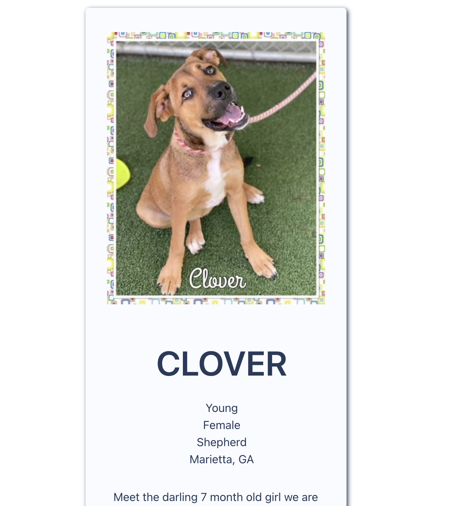

# Furbaby

## Purpose

Welcome to Furbaby Finder! the site that helps you match with your preferred Fur Baby!
Feel free to browse until you find what you believe to be your perfect match.
feel free to checkout the adoptee's profile for more information on the pet of your dreams!

## Description

This app allows the user to select criteria they want for a puppy. They can select the type of pet, gender, and distance away from a zipcode specified by the user. App employs PetFinder API to provide information about each pet. It also uses the DogFacts API to display random dog facts. User can save their favorite pets and delete them from their saved pets if they decide to change their mind.

## GitHub Repo URL

https://github.com/glo6al/project-1-tm-9

## Deployed Application URL

https://glo6al.github.io/project-1-tm-9/

## Contributors

- Andrew Towers
- Sadie Stamper
- Jorge Monteagudo
- Jack Nowaczewski
